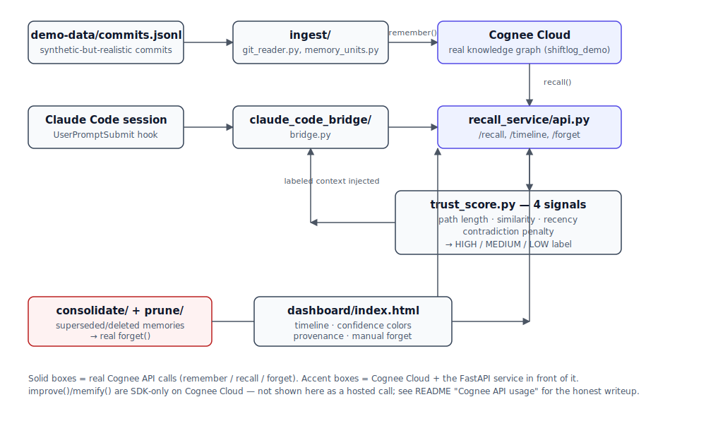

# cognee-agent-memory

**Trust-weighted memory for AI coding agents.**
Built for *The Hangover Part AI: Where's My Context?* (WeMakeDevs x Cognee hackathon, June 29 – July 5, 2026).

**🔗 Live deployment:** [web-production-67f7f.up.railway.app](https://web-production-67f7f.up.railway.app) — real Cognee Cloud dataset, deployed on Railway. Try `/timeline`, `/recall?query=...`, `/health`. *(The dashboard UI is branded "SessionZero" — same project, that's just the interface name.)*
**🎥 Demo video:** _[to be added — recording in progress, see `demo/demo_script.md` for the shot list]_

> Every new AI coding agent session starts with total amnesia. You explain the same architecture decision three times. The agent forgets why you rejected an approach last week and suggests it again. Worse — if you *do* bolt memory onto an agent, a wrong or stale memory gets injected with the same confidence as a correct one, and the agent confidently repeats an old mistake.
>
> cognee-agent-memory fixes both problems: it remembers, **and it tells you how sure it is and why.**

---

## Table of contents

- [The problem](#the-problem)
- [Architecture](#architecture)
- [Why a synthetic demo project ("ShiftLog")?](#why-a-synthetic-demo-project-shiftlog)
- [Cognee API usage](#cognee-api-usage)
- [Trust scoring](#trust-scoring)
- [Setup](#setup)
- [Future work: agent-agnostic by design](#future-work-agent-agnostic-by-design)
- [AI Assistance Disclosure](#ai-assistance-disclosure)
- [Known limitations](#known-limitations)
- [Non-negotiables this project followed](#non-negotiables-this-project-followed)

---

## The problem

AI coding agents (Claude Code, Codex, etc.) have no memory across sessions. Bolting on a naive memory layer doesn't actually fix the underlying failure mode — it just changes *what* gets confidently repeated. If a memory is stale or has been superseded by a later decision, most memory layers will still hand it to the agent with full confidence, and the agent will act on it exactly as if it were current.

cognee-agent-memory is a memory layer built on top of [Cognee](https://www.cognee.ai)'s knowledge-graph memory lifecycle (`remember` / `recall` / `improve`+`memify` / `forget`), with one addition: every recalled memory is trust-scored and labeled **HIGH / MEDIUM / LOW confidence** before it ever reaches the agent. A stale, contradicted memory doesn't get silently dropped *or* silently trusted — it gets surfaced with a visible warning, so the human (or the agent) can decide.

### Why not just grep the git log?

A naive approach — text-search commit history, or dump the last N commits into the agent's context — solves *recall* but not *trust*. It has no way to know that a decision from three months ago was later contradicted or reverted; it would hand the agent both the original decision and its replacement with equal weight, and the agent has no signal for which one to believe. Storage isn't the hard part — any grep-able log or vector index gives you that. The actual value here is **contradiction-aware trust scoring at read time**: recognizing that two memories disagree, and telling the agent (and the human) which one to trust and why, instead of silently picking one or handing over both as if they were equally current.

---

## Architecture



Commits flow through ingestion into Cognee's knowledge graph via `remember()`; a Claude Code hook queries `recall()`, scores results with four trust signals, and injects labeled context; `forget()` prunes stale or superseded memories; the dashboard exposes the timeline and manual pruning.

### Components

| Path | What it does |
|---|---|
| `ingest/` | Reads commit history (`demo-data/commits.jsonl`), structures it into "memory units" (decisions, bug+fix pairs, reverts, contradictions, deletions) with provenance, calls real `remember()` |
| `recall_service/` | `trust_score.py` — the four-signal scoring function; `api.py` — FastAPI `/recall`, `/timeline`, `/forget` |
| `consolidate/` | `memify_job.py` — consolidation, reframed to reference-graph analysis + real `forget()`, verified via before/after `recall()` (see below) |
| `prune/` | `forget_watcher.py` — detects deleted/superseded memories, calls real `forget()` |
| `claude_code_bridge/` | `bridge.py` — a real Claude Code `UserPromptSubmit` hook that injects trust-labeled recall context before the agent responds. Confirmed working in a live Claude Code session, not just via direct script invocation — asking *"Does ShiftLog use JWT for authentication?"* correctly surfaced both the HIGH-confidence current decision and the LOW-confidence superseded one, and Claude Code's answer cited both. `codex_bridge.py` — an extensibility demo for Codex (see "Future work" below). |
| `dashboard/` | `index.html` — single-page timeline UI, no build step |
| `demo-data/` | Synthetic-but-realistic commit history + session transcripts for a fictional project ("ShiftLog"), generated for this demo rather than pulled from a real external repo |

---

## Why a synthetic demo project ("ShiftLog")?

The demo data is deliberately synthetic rather than pulled from a real external repository — this keeps the project fully self-contained and reviewable without needing access to any other codebase. It's designed to be *realistic*, not simplistic: 16 commits spanning architecture decisions, bug fixes, a reverted approach (Redis pub/sub → polling), and two independent contradiction cases (a database-hosting decision and an auth-approach decision), so the trust-scoring and consolidation logic has genuine cases to reason about, not synthetic scoring inputs made up after the fact.

---

## Cognee API usage

This project deliberately exercises Cognee's memory lifecycle as deeply as the hosted Cognee Cloud API allows — and is explicit about where the hosted API's real surface differs from the full SDK.

| API | How it's used here | Status |
|---|---|---|
| **`remember()`** | Every commit becomes a "memory unit" (decision, bug+fix, revert, contradiction, or deletion) and is ingested via a real call to Cognee Cloud's `/api/v1/remember`. 16 memory units ingested across three batches. | ✅ Real, verified |
| **`recall()`** | Queried live by `claude_code_bridge/bridge.py` before every coding-session prompt, by `recall_service/api.py`'s `/recall` endpoint (Cognee's `CHUNKS` search type, ranked and trust-scored), and by its `/summaries` endpoint (Cognee's real `SUMMARIES` search type — condensed bullet-point recaps, a genuinely different output shape, shown in the dashboard's Search tab as-is and deliberately *not* trust-scored, since retrofitting `trust_score.py` to a different result shape would mean touching its already-verified logic). (`recall_service/api.py`'s `/timeline` endpoint does *not* call `recall()` — it lists the dataset's data directly and computes a query-independent baseline score, since a chronological view has no query to search against.) | ✅ Real, verified |
| **`forget()`** | Triggered on two kinds of real events: (1) a file/feature deletion commit (`prune/forget_watcher.py`), and (2) a memory unit that a newer, contradicting memory unit supersedes (`consolidate/memify_job.py`). Both were verified with real before/after `recall()` diffs proving the graph actually changed, not just that an API call returned 200. Also manually triggerable from the dashboard. | ✅ Real, verified |
| **`improve()` / `memify()`** | **Honest limitation, not a workaround.** Verified two independent ways — the tenant's live `GET /openapi.json`, and Cognee's own docs at docs.cognee.ai/api-reference — that `improve()`/`memify()` are **SDK-only**: they take live Python objects and are architecturally not exposed as HTTP endpoints on Cognee Cloud. Calling the in-process SDK functions would build a disconnected *local* graph (needing its own separate LLM key) rather than operate on the real ingested cloud dataset, so it wouldn't demonstrate anything real. **Consolidation is instead implemented as a legitimate adaptation**: `consolidate/memify_job.py`'s `consolidate_contradictions()` uses the reference graph `ingest/memory_units.py` extracts from commit messages to identify superseded memories, resolves each one's real Cognee `data_id` (via a dataset listing, not a search), and calls real `forget()` on it — achieving the same practical outcome (stale/contradicted knowledge is pruned) within what the hosted API actually supports. The before/after proof that pruning worked uses a real `recall()` query, but `recall()` itself is not part of the consolidation logic — it's the verification step. | ⚠️ SDK-only on Cognee Cloud — reframed via reference-graph analysis + real `forget()`, verified with `recall()` |

We'd rather show you exactly where the hosted API's real boundary is than claim four-for-four when one of those calls would have been fake.

---

## Trust scoring

`recall_service/trust_score.py` combines four signals into one score, deliberately kept as a simple, explainable weighted mean rather than anything opaque:

1. **`path_length_score`** — from Cognee's real `topological_rank` field on graph search results. Included because a memory that's more directly connected in the knowledge graph is more likely to be a first-order fact about the thing you asked, rather than something pulled in by a loose or indirect association — shorter path should mean higher trust. *Known limitation:* in this demo's graph size, `topological_rank` comes back `0` for every result, so this signal isn't currently discriminating between memories — it's a real API-sourced field, just not yet varying at this scale.
2. **`similarity_score`** — Cognee Cloud's `CHUNKS` search returns pre-ranked results but no raw cosine score in this API version (`score: null`), so we use rank position as the similarity proxy. Included because relevance to the actual question is table-stakes — a highly-trusted memory that's off-topic still shouldn't dominate the answer, so semantic match has to be one of the inputs, not an afterthought.
3. **`recency_score`** — exponential decay from the memory's source-commit timestamp, 30-day half-life. Included because architecture decisions and bug fixes go stale even without an explicit contradiction being recorded — a half-life gives old-but-never-formally-superseded memories a gentle downward pull instead of treating a two-year-old note and a two-day-old one as equally current.
4. **`contradiction_penalty`** — a flat penalty applied when a newer ingested memory explicitly supersedes this one (tracked via reference extraction from commit messages, not from Cognee directly). Included because this is the actual failure mode the project exists to prevent (see "Why not just grep the git log?" above) — an explicit contradiction is the strongest, most direct signal that a memory is wrong *now*, so it's weighted as a multiplicative discount on the whole score rather than just another additive term, deliberately making it capable of overriding otherwise-high path/similarity/recency scores.

The specific weights (equal thirds for the first three signals, 0.6 for the contradiction penalty, 30-day recency half-life) are reasoned defaults chosen for explainability, not the result of empirical tuning against a labeled dataset — we'd rather say that plainly than imply a rigor we haven't done.

```
score = mean(path_length, similarity, recency) × (1 − contradiction_penalty)
```

clipped to `[0, 1]`, labeled **HIGH** (≥0.7) / **MEDIUM** (≥0.4) / **LOW — verify before trusting** (below 0.4).

**Verified example** (real data, not a synthetic test case): for the query *"Does ShiftLog use JWT for authentication?"*, the correct, current decision (session cookies) scored **0.97 HIGH**, while the old, superseded JWT decision — still semantically on-topic — scored only **0.31 LOW**, flagged with a contradiction warning instead of silently injected. (These exact numbers drift slightly day to day since recency is date-based decay — rerun `ingest.recall_check` for the current values.)

---

## Setup

```bash
git clone https://github.com/Aashritha-2005/sessionZero-agent-memory.git && cd sessionZero-agent-memory
python3 -m venv .venv && source .venv/bin/activate
pip install -r requirements.txt

cp .env.example .env
# fill in COGNEE_API_KEY, COGNEE_API_BASE_URL, COGNEE_TENANT_ID from your Cognee Cloud tenant

# ingest the demo data (real remember() calls, takes a few minutes)
python3 -m ingest.remember_client

# sanity check
python3 -m ingest.recall_check

# run the recall API + dashboard
.venv/bin/uvicorn recall_service.api:app --host 127.0.0.1 --port 8000 &
python3 -m http.server 5173 --directory dashboard &
# open http://127.0.0.1:5173/index.html

# run tests
python3 -m pytest recall_service/tests/ claude_code_bridge/tests/ -v
```

The `claude_code_bridge/bridge.py` hook is wired into `.claude/settings.json` as a `UserPromptSubmit` hook — opening this project in Claude Code will inject trust-labeled recall context before every prompt automatically.

---

## Future work: agent-agnostic by design

`recall_service/api.py` is a plain HTTP service exposing trust-scored recall — it isn't tied to Claude Code specifically. `claude_code_bridge/bridge.py` is one integration on top of it, and it's the one that's actually proven: live-tested inside a real Claude Code session (see above).

As an extensibility note, not a proof point: `claude_code_bridge/codex_bridge.py` sketches what a second integration would look like for Codex. It implements Codex's real `UserPromptSubmit` hook contract — copied from Cognee's own shipped Codex plugin source on GitHub, not guessed — and makes real HTTP calls to `recall_service/api.py`'s `/recall` endpoint, returning correct HIGH/LOW confidence results when invoked directly. **It has not been tested inside a live Codex session** — that would require installing Codex and the full `codex plugin marketplace add ...` flow, which was out of scope for the time available. Treat it as a demonstration of the integration pattern, not a validated second-agent deployment.

---

## AI Assistance Disclosure

Built with assistance from **Claude Code** for implementation — including the ingestion pipeline, trust-scoring logic, Cognee Cloud API integration, the Claude Code bridge, the dashboard, and this README. Architecture, trust-scoring design, project direction, and all API-usage/limitation decisions (e.g. the `improve()`/`memify()` reframing) were directed by **Aashritha Lakshmi Mallampati**, who reviewed and approved each stage before proceeding to the next.

---

## Known limitations

- **The dataset is small enough to hide real problems.** 16 memory units, one contradiction pair, one revert, one deletion. That's enough to prove the mechanism works end-to-end, but it's also small enough that two real questions remain genuinely open, not quietly resolved:
  - `path_length_score` never discriminates in this dataset — `topological_rank` comes back `0` for every result, so it's dead weight right now, not a real fourth signal. Fixing this would need a much larger, structurally varied graph (hundreds of interconnected nodes) than we could build and validate before the deadline.
  - We have exactly one example of each interesting case (one contradiction, one revert). What happens with 500 commits and a dozen overlapping contradictions is an unanswered scale question — we don't know, and we'd rather say that than imply we do.
- During development, one memory unit was observed to disappear from the live Cognee Cloud dataset without any explicit `forget()` call in our session history — cause unconfirmed (possibly server-side dedup/pruning behavior we don't have visibility into). It was successfully re-ingested. We're disclosing this as an open question about hosted-tenant data persistence, not something we've solved.

---

## Non-negotiables this project followed

- No mocked Cognee calls — every `remember()`/`recall()`/`forget()` claim in this README is backed by a real API call, verified with raw output (see `PROJECT_PLAN.md`'s `CURRENT STATUS` log for the full trail).
- Trust scoring is a simple weighted mean, not an opaque model — a judge should be able to read the four signals above and understand each in one sentence.
- Where the real hosted API had a gap (`improve()`/`memify()`), we said so plainly rather than routing around it silently.
